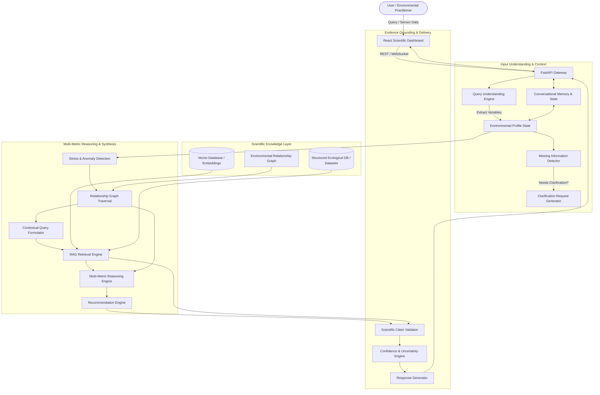

# System Architecture Specification — Darukaa.Earth

## 1. Problem Statement & System Objective

### 1.1 The Ecological Complexity Problem
Ecological degradation and biodiversity loss are driven by multi-factorial environmental stressors. A farmer or land manager observing declining biodiversity cannot reverse the trend with broad, generic directives like "use organic fertilizers" or "plant trees." Ecological systems exhibit non-linear thresholds:
- Soil organic carbon below 1.0% significantly impairs microbiological nutrient cycling and water holding capacity.
- In low-rainfall (<400 mm/year) semi-arid environments, fast-growing non-native trees deplete deep groundwater tables, exacerbating ecological collapse.
- Monoculture farming fragments native pollinator corridors and depletes specific soil micronutrient pools.

### 1.2 System Objective
**Darukaa.Earth** is an AI Environmental Scientist platform designed to:
1. Ingest, extract, and maintain a structured, multi-variable **Environmental Profile**.
2. Identify missing or ambiguous environmental factors and proactively request high-priority clarifications.
3. Traverse a deterministic **Environmental Relationship Graph** to identify cascading ecological stress mechanisms.
4. Retrieve high-precision, peer-reviewed scientific literature and institutional frameworks (FAO, IPCC) via a hybrid **Vector RAG Engine**.
5. Reason across multiple variables simultaneously to synthesize context-specific, constraint-validated interventions.
6. Enforce strict anti-hallucination guardrails via an **Evidence Validation & Confidence Engine**.

---

## 2. High-Level Architecture & End-to-End Data Flow

---

## 3. Detailed Component Decomposition

### 3.1 Input Understanding & Environmental Profile Manager (`app/services/extraction.py`, `app/schemas/environment.py`)
- **Query Understanding**: Employs typed function calling / structured LLM output (constrained by Pydantic schemas) to extract quantitative values, units, qualitative descriptions, and geographic references from unstructured text.
- **Environmental Profile**: Maintains a canonical data structure categorizing variables into Soil, Land, Biodiversity, Climate, Human Impact, and Geographic layers.
- **Provenance & State Tracking**: Every field tracks its status: `PROVIDED` (user explicitly stated), `ESTIMATED` (inferred from region/proxy data), `UNKNOWN` (user stated lack of knowledge), or `MISSING` (unspecified).

### 3.2 Conversational Memory & Context Manager (`app/memory/context.py`)
- Maintains multi-turn conversation sessions with persistent state across turns.
- Deduplicates incoming user answers against existing profile state, ensuring previously provided metrics are never re-requested.
- Maintains rolling semantic summaries of previous recommendations and retrieved citations.

### 3.3 Missing Information & Clarification Engine (`app/reasoning/missing_info.py`)
- Evaluates the current `EnvironmentalProfile` against minimal viable reasoning constraints for the user's specific ecological concern.
- Prioritizes top 2-3 missing critical variables rather than overwhelming the user with a questionnaire.
- Supports graceful fallback: allows qualitative reasoning if quantitative data is unavailable.

### 3.4 Scientific Knowledge Retrieval & Vector RAG (`app/rag/`)
- **Corpus**: Peer-reviewed agroecology papers, FAO ecosystem restoration guidelines, IPCC climate mitigation reports, and global soil datasets.
- **Chunking & Indexing**: Semantic chunking preserving document headers, methodology sections, target biomes, and citation metadata.
- **Hybrid Retrieval**: Combines dense vector similarity (SentenceTransformers/OpenAI embeddings) with exact metadata filtering (biome, soil category, rainfall class).
- **Fallback Guarantee**: Returns an explicit *"Insufficient scientific evidence retrieved for this specific claim"* notice when relevance thresholds are not met.

### 3.5 Environmental Relationship Graph (`app/reasoning/graph.py`, `app/data/relationships.json`)
- A deterministic, directed knowledge graph of ecological interactions:
  - Example: `Monoculture --[decreases (mechanism: structural homogeneity)]--> Habitat Diversity --[decreases]--> Pollinator Abundance`.
  - Example: `Low SOC (<0.8%) --[impairs]--> Soil Hydraulic Conductivity --[amplifies]--> Drought Sensitivity`.
- Informs the LLM reasoning pipeline of verified causal pathways, preventing spurious correlations.

### 3.6 Multi-Metric Reasoning Engine (`app/reasoning/orchestrator.py`)
- Executes a 6-step reasoning pipeline:
  1. **Stressor Identification**: Evaluates profile variables against scientific baseline thresholds.
  2. **Interacting Variables Matrix**: Identifies compounding stress pairs (e.g., Low SOC + Arid Climate + High Tillage).
  3. **Causal Propagation**: Maps interacting stressors through the Relationship Graph.
  4. **Evidence Retrieval**: Gathers scientific literature addressing the specific compounding stressors and target biome.
  5. **Candidate Intervention Generation & Constraint Checking**: Screens potential interventions (e.g., agroforestry, cover crops, biochar, buffer strips) against environmental constraints (e.g., water availability, soil pH limits).
  6. **Metric Impact & Horizon Projection**: Predicts directional shifts in specific metrics across short (0-1 yr), medium (1-5 yrs), and long (5-15 yrs) horizons.

### 3.7 Evidence Validation & Anti-Hallucination Engine (`app/validation/evidence.py`)
- Audits synthesized recommendations against retrieved source chunks:
  - Validates that numerical claims, species recommendations, and restoration rates directly originate from retrieved evidence chunks.
  - Rewrites unsupported claims to conservative qualitative language if evidence is purely theoretical.
- Calculates an objective **Confidence Score** based on input completeness, retrieval cosine similarity, and source credibility.

---

## 4. Technology Decisions & Rationale

| Layer | Selected Technology | Rationale | Alternatives Evaluated |
|---|---|---|---|
| **API Framework** | FastAPI (Python 3.11+) | Native async support, high performance, automatic OpenAPI documentation, tight Pydantic v2 integration. | Flask, Django, Express.js |
| **Data Validation** | Pydantic v2 | Strict type safety, custom field validators, schema serialization, JSON Schema generation. | Marshmallow, Cerberus |
| **Vector Database** | ChromaDB / FAISS with modular interface (`IVectorStore`) | Embeddable, zero-latency in-memory/file-persisted execution for local development & hackathons, easily swappable for pgvector/Qdrant in production. | Pinecone, Weaviate, Milvus |
| **LLM Interface** | Modular `LLMProvider` abstraction (OpenAI, Gemini, Anthropic, Ollama) | Zero vendor lock-in; allows seamless switching between cloud frontier models and local private LLMs. | Direct SDK hardcoding |
| **Structured Store** | SQLite / SQLAlchemy with repository pattern | Zero configuration for development, straightforward migration path to PostgreSQL. | Raw SQLite, MongoDB |
| **Frontend** | React 18 + TypeScript + Vite + Tailwind CSS | Rapid prototyping, type-safe contract alignment with backend schemas, interactive dashboard rendering. | Next.js, Vue, Streamlit |

---

## 5. Architectural Boundaries & Modularity Contracts

All major subsystems communicate through abstract interfaces located in `app/core/interfaces.py`:
- `ILLMProvider`: `generate_text()`, `generate_structured()`, `get_embeddings()`
- `IVectorStore`: `add_documents()`, `search_similarity()`, `delete_collection()`
- `IRelationshipGraph`: `get_outgoing_edges()`, `find_paths()`, `get_affected_metrics()`
- `IConversationRepository`: `get_context()`, `save_turn()`, `update_profile()`

This ensures individual components can be tested in isolation with deterministic mocks, meeting the strict Phase-by-Phase verification mandate.
