# Master Development Phases & Roadmap — Darukaa.Earth

This document outlines the strict 25-phase incremental development roadmap for **Darukaa.Earth**. In accordance with the system development rules, each phase must be completely implemented, tested, verified, and documented before proceeding to the subsequent phase.

---

## 🗺️ Master Phase Overview

```mermaid
gantt
    title Darukaa.Earth 25-Phase Implementation Master Plan
    dateFormat  X
    axisFormat %s
    section Foundations
    Phase 0 - Project Planning & Architecture           :done, p0, 0, 1
    Phase 1 - Repository & App Foundation              :active, p1, 1, 2
    Phase 2 - Environmental Data Model                  :p2, 2, 3
    Phase 3 - Ingestion Pipeline                       :p3, 3, 4
    section Knowledge & RAG
    Phase 4 - Scientific Knowledge Base                :p4, 4, 5
    Phase 5 - Document Processing & Embeddings          :p5, 5, 6
    Phase 6 - RAG Retrieval Engine                     :p6, 6, 7
    section Intelligence Layer
    Phase 7 - Query Understanding & Extraction         :p7, 7, 8
    Phase 8 - Missing Information Engine               :p8, 8, 9
    Phase 9 - Conversational Memory & Context          :p9, 9, 10
    Phase 10 - Environmental Relationship Graph        :p10, 10, 11
    Phase 11 - Multi-Metric Reasoning Engine           :p11, 11, 12
    Phase 12 - Recommendation Engine                   :p12, 12, 13
    section Validation & Interface
    Phase 13 - Scientific Claim Validation             :p13, 13, 14
    Phase 14 - Confidence Engine                       :p14, 14, 15
    Phase 15 - Final Response Generator                :p15, 15, 16
    Phase 16 - API Design & Implementation             :p16, 16, 17
    Phase 17 - Scientific Frontend Dashboard           :p17, 17, 18
    section Evaluation & Hardening
    Phase 18 - Demo Scenarios & Benchmarks             :p18, 18, 19
    Phase 19 - Evaluation Framework                    :p19, 19, 20
    Phase 20 - Anti-Hallucination Guardrails           :p20, 20, 21
    Phase 21 - Logging & Observability                 :p21, 21, 22
    Phase 22 - Comprehensive Testing Suite             :p22, 22, 23
    Phase 23 - Dockerization & Deployment              :p23, 23, 24
    Phase 24 - Final Polish                            :p24, 24, 25
    Phase 25 - Hackathon Demo Mode                     :p25, 25, 26
```

---

## 📋 Phase-by-Phase Deliverables & Verification Criteria

### Phase 0 — Project Planning & Architecture (Current Phase)
- **Deliverables**: `/README.md`, `/docs/architecture.md`, `/docs/data-model.md`, `/docs/rag-design.md`, `/docs/reasoning-engine.md`, `/docs/api-design.md`, `/docs/development-phases.md`.
- **Verification**: All documentation created, reviewed, and approved before code execution.

### Phase 1 — Repository & Application Foundation
- **Deliverables**: Python FastAPI project structure, `GET /health` endpoint, Pydantic settings config, logging framework, CORS, basic Vite React frontend skeleton, Docker compose baseline.
- **Verification**: Frontend successfully pings `/health` and displays healthy status.

### Phase 2 — Environmental Data Model
- **Deliverables**: Pydantic v2 schemas in `app/schemas/environment.py`, `ValueStatus` provenance tagging, unit normalization, field range validation.
- **Verification**: Pytest unit tests verifying partial data support, validation errors on invalid values (e.g. pH 16), and proper state tagging.

### Phase 3 — Data Ingestion Pipeline
- **Deliverables**: `scripts/ingest_environmental_data.py`, CSV/JSON ingestion loaders, unit normalization routines (inches to mm, SOM to SOC, Fahrenheit to Celsius).
- **Verification**: Batch ingestion of sample environmental dataset into clean structured records with 100% schema validation.

### Phase 4 — Scientific Knowledge Base Corpus
- **Deliverables**: Curated knowledge corpus in `data/raw/` and `data/knowledge/` covering FAO soil recarbonization, IPCC land reports, agroforestry systems, biodiversity restoration papers.
- **Verification**: Academic metadata validation (every document has DOI/URL, author, year, topic, biome).

### Phase 5 — Document Processing & Embeddings
- **Deliverables**: Semantic chunking script with metadata preservation, embedding provider abstraction (`IEmbeddingProvider`), local and cloud embedding implementations, vector store indexing (`IVectorStore` / ChromaDB).
- **Verification**: Ingest corpus, verify chunk boundaries, verify metadata persistence in vector store.

### Phase 6 — RAG Retrieval Engine
- **Deliverables**: `app/rag/retrieval.py`, hybrid semantic + metadata-filtered search, relevance score thresholding, fallback on insufficient evidence.
- **Verification**: Pytest retrieval tests verifying accurate chunk retrieval for multi-variable queries and explicit fallback message when similarity < 0.70.

### Phase 7 — Query Understanding & Extraction Engine
- **Deliverables**: `app/services/extraction.py`, structured LLM extraction with JSON schema constraints, mapping natural language to `EnvironmentalProfile`.
- **Verification**: Test extraction across complex phrases (e.g., "semi-arid wheat farm with 0.3% carbon") yielding exact Pydantic profile.

### Phase 8 — Missing Information & Clarification Engine
- **Deliverables**: `app/reasoning/missing_info.py`, missing variable detector, prioritization heuristics (top 2-3 essential variables), clarification prompt generator.
- **Verification**: Query "My biodiversity is declining" triggers targeted clarification questions; full profile triggers zero clarification.

### Phase 9 — Conversational Memory & State
- **Deliverables**: `app/memory/context.py`, session state management, incremental profile merging across turns, deduplication of questions.
- **Verification**: 4-turn conversation test verifying variable accumulation without re-asking answered questions.

### Phase 10 — Environmental Relationship Graph
- **Deliverables**: `app/data/relationships.json`, `app/reasoning/graph.py`, graph traversal routines, causal mechanism pathfinding.
- **Verification**: Graph queries successfully map `monoculture -> habitat diversity -> pollinator richness` and `low SOC -> water retention -> crop stress`.

### Phase 11 — Multi-Metric Reasoning Engine
- **Deliverables**: `app/reasoning/orchestrator.py`, stressor detector, compounding interaction matrix, candidate intervention generator, ecological constraint solver.
- **Verification**: Test scenario with Low SOC + Low Rainfall + Monoculture produces validated candidate interventions without recommending water-heavy trees.

### Phase 12 — Recommendation Engine
- **Deliverables**: `app/recommendations/generator.py`, structured recommendation format (Action, Why, Affected Metrics, Time Horizon, Evidence, Confidence).
- **Verification**: Verified 2–5 actionable, non-generic recommendations generated per scenario with explicit metric shifts.

### Phase 13 — Scientific Claim Validation
- **Deliverables**: `app/validation/evidence.py`, claim verification against retrieved chunk text, conservative rewriting of ungrounded numerical claims.
- **Verification**: Test that unbacked quantitative assertions (e.g., "increases carbon by exactly 40%") are rewritten to qualitative ranges backed by citations.

### Phase 14 — Confidence Engine
- **Deliverables**: `app/validation/confidence.py`, 4-factor deterministic scoring algorithm ($C_{\text{profile}}, S_{\text{retrieval}}, G_{\text{path}}, A_{\text{consensus}}$).
- **Verification**: Complete inputs + strong citations yield `High`; missing variables yield `Medium`/`Low` with explicit uncertainty explanations.

### Phase 15 — Final Structured Response Generator
- **Deliverables**: `app/services/response_generator.py`, unified markdown and JSON output format (Current Conditions, Key Interactions, Recommendations, Evidence, Uncertainties).
- **Verification**: End-to-end output meets the exact specification in Phase 15 of user guidelines.

### Phase 16 — API Design & Router Implementation
- **Deliverables**: FastAPI routers for `/chat`, `/environment`, `/reasoning`, `/knowledge`, `/health`, `/demo`.
- **Verification**: OpenAPI docs verified via Swagger UI, end-to-end HTTP integration tests pass.

### Phase 17 — Scientific Frontend Dashboard
- **Deliverables**: React TypeScript dashboard featuring Environmental Profile cards, Interactive Chat, Reasoning Graph visualizer, Recommendation Cards, and Scientific Evidence drawer.
- **Verification**: Browser subagent interactive testing verifying seamless UI flow and real-time updates.

### Phase 18 — Predefined Demo Scenarios
- **Deliverables**: 5 pre-packaged benchmark scenarios (Semi-Arid Monoculture, Habitat Fragmentation, Agrochemical Runoff, Incomplete Inquiry, Multi-Turn Dialogue).
- **Verification**: One-click demo execution reproducing expected scientific reasoning and recommendations.

### Phase 19 — Internal Evaluation Framework
- **Deliverables**: `scripts/evaluate_system.py`, automated scoring across Retrieval Relevance, Grounding, Multi-Metric Reasoning, Citation Accuracy, and Memory.
- **Verification**: Evaluation report generated showing pass rates across all 5 benchmark scenarios.

### Phase 20 — Anti-Hallucination Hardening
- **Deliverables**: Final safety filters, citation integrity checks, forbidden phrase detectors, boundary condition asserts.
- **Verification**: Adversarial input tests (asking about fictional ecosystems or impossible interventions) handled safely with evidence fallback.

### Phase 21 — Logging & Observability
- **Deliverables**: Structured JSON logging, request tracing IDs, timing metrics for RAG retrieval and reasoning steps.
- **Verification**: Verify clean, anonymized structured logs emitted for every API transaction.

### Phase 22 — Comprehensive Testing Suite
- **Deliverables**: Pytest suite covering unit tests, integration tests, RAG tests, and reasoning tests with >85% code coverage.
- **Verification**: `pytest` passes with zero failures.

### Phase 23 — Dockerization & Deployment
- **Deliverables**: Multi-stage `Dockerfile` (frontend + backend), `docker-compose.yml`, environment configuration scripts.
- **Verification**: `docker compose up --build` boots entire stack cleanly and passes health check.

### Phase 24 — Final Polish & Code Quality
- **Deliverables**: Static analysis (Ruff/Flake8, TypeScript tsc), dead code elimination, documentation cleanup.
- **Verification**: Zero lint errors, zero console errors, clean setup walkthrough.

### Phase 25 — Hackathon Demo Mode & Visualizer
- **Deliverables**: Judge Demo Walkthrough Mode with step-by-step pipeline inspector (Extraction -> Graph -> RAG -> Reasoning -> Recommendations).
- **Verification**: Live demo presentation validated end-to-end.
