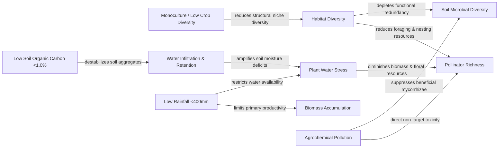

# Multi-Metric Reasoning Engine & Relationship Graph Specification — Darukaa.Earth

## 1. Core Architectural Principle

An LLM should never be allowed to "intuit" ecological recommendations directly from unstructured text. Ecological systems obey physical, chemical, and biological conservation laws. The **Reasoning Engine** in Darukaa.Earth is a hybrid deterministic-probabilistic system combining:
1. An explicit, directed **Environmental Relationship Graph (ERG)**.
2. A deterministic **Stressor & Constraint Solver**.
3. Scientific evidence grounding via **RAG**.
4. Probabilistic LLM orchestration constrained by typed schemas.

---

## 2. Environmental Relationship Graph (ERG)

### 2.1 Graph Structure
The ERG is represented as a directed multigraph $G = (V, E)$, where vertices $V$ represent environmental variables or ecological states, and edges $E$ represent causal relationships.



### 2.2 Edge Representation Schema (`app/data/relationships.json`)
```json
[
  {
    "id": "rel_soc_water_retention",
    "source_variable": "soil.organic_carbon_percent",
    "target_variable": "soil.moisture_retention",
    "direction": "positive",
    "mechanism": "Every 1% increase in SOC increases soil available water capacity by ~1.5–3.0% vol depending on texture",
    "threshold_condition": "value < 1.0%",
    "stress_classification": "soil_degradation",
    "evidence_sources": ["fao_soil_2022", "libohova_2018_soil_water"]
  },
  {
    "id": "rel_monoculture_habitat_diversity",
    "source_variable": "land.cropping_pattern",
    "target_variable": "biodiversity.habitat_diversity",
    "direction": "negative",
    "mechanism": "Monoculture homogenizes canopy architecture and floral bloom periods, eliminating microrefugia",
    "threshold_condition": "value == 'monoculture'",
    "stress_classification": "structural_homogenization",
    "evidence_sources": ["tamburini_2020_crop_diversification"]
  },
  {
    "id": "rel_low_rainfall_tree_competition",
    "source_variable": "climate.rainfall_mm_year",
    "target_variable": "land.agroforestry_compatibility",
    "direction": "constraint",
    "mechanism": "In regions with rainfall < 400 mm/yr, high-water-demand tree species compete with crops for groundwater",
    "threshold_condition": "value < 400.0",
    "stress_classification": "hydrological_constraint",
    "evidence_sources": ["ipcc_land_2019_ch4"]
  }
]
```

---

## 3. Multi-Metric Reasoning Pipeline

```
EnvironmentalProfile
         │
         ▼
┌─────────────────────────────────────────┐
│ 1. Anomaly & Stressor Detection         │  Evaluates variables against ecological baselines
│    (e.g., SOC < 1.0%, Rainfall < 400mm) │
└────────────────────┬────────────────────┘
                     │
                     ▼
┌─────────────────────────────────────────┐
│ 2. Compounding Interaction Matrix       │  Identifies multi-variable stress synergies
│    (e.g., Low SOC + Arid + Monoculture) │  (e.g., severe water stress + structural collapse)
└────────────────────┬────────────────────┘
                     │
                     ▼
┌─────────────────────────────────────────┐
│ 3. Graph Traversal & Mechanism Tracing  │  Traces causal pathways to target biodiversity metric
│    (ERG propagation)                    │
└────────────────────┬────────────────────┘
                     │
                     ▼
┌─────────────────────────────────────────┐
│ 4. Constraint-Filtered Candidate Gen.   │  Generates candidate interventions and drops
│    (e.g., filter out water-heavy crops) │  contraindicated practices
└────────────────────┬────────────────────┘
                     │
                     ▼
┌─────────────────────────────────────────┐
│ 5. Scientific Evidence Grounding        │  Retrieves peer-reviewed literature for candidate
│    (Vector RAG)                         │  interventions under specific environmental constraints
└────────────────────┬────────────────────┘
                     │
                     ▼
┌─────────────────────────────────────────┐
│ 6. Multi-Horizon Impact Projection      │  Estimates directional metric shifts over
│    (Short / Med / Long Term)            │  0-1 yr, 1-5 yrs, 5-15 yrs with confidence score
└─────────────────────────────────────────┘
```

---

## 4. Constraint Satisfaction & Contraindication Solver

The engine enforces strict ecological safety checks before approving any candidate intervention:

```python
class EcologicalConstraintRules:
    @staticmethod
    def evaluate_contraindications(profile: EnvironmentalProfile, candidate_intervention: str) -> List[str]:
        contraindications = []
        
        # Rule 1: Semi-arid tree selection
        if profile.climate.rainfall_mm_year.value and profile.climate.rainfall_mm_year.value < 400:
            if candidate_intervention in ["eucalyptus_afforestation", "dense_canopy_agroforestry", "high_water_cover_crops"]:
                contraindications.append(
                    f"Contraindicated: {candidate_intervention} requires >600mm rainfall; would exacerbate groundwater depletion in current {profile.climate.rainfall_mm_year.value}mm regime."
                )
                
        # Rule 2: High pH / Saline soil interventions
        if profile.soil.ph.value and profile.soil.ph.value > 8.2:
            if candidate_intervention in ["acid_loving_green_manure", "calcifuge_species"]:
                contraindications.append(
                    f"Contraindicated: Soil pH {profile.soil.ph.value} is alkaline/sodic. Requires salt-tolerant halophytic or mycorrhizal-inoculated species."
                )
                
        # Rule 3: Heavy tillage on low SOC soil
        if profile.soil.organic_carbon_percent.value and profile.soil.organic_carbon_percent.value < 0.5:
            if candidate_intervention in ["deep_plowing_green_manure"]:
                contraindications.append(
                    f"Contraindicated: Deep tillage on degraded soil (SOC {profile.soil.organic_carbon_percent.value}%) will accelerate residual carbon oxidation and microbial lysis."
                )
                
        return contraindications
```

---

## 5. Confidence Calculation Algorithm

The confidence of an ecological recommendation is calculated deterministically across 4 weighted factors:

$$\text{Confidence Score} = w_1 \cdot C_{\text{profile}} + w_2 \cdot S_{\text{retrieval}} + w_3 \cdot G_{\text{path}} + w_4 \cdot A_{\text{consensus}}$$

Where:
1. $C_{\text{profile}}$ (**Profile Completeness**, weight $w_1 = 0.30$): Fraction of critical environmental variables provided by the user vs total required.
2. $S_{\text{retrieval}}$ (**Retrieval Evidence Quality**, weight $w_2 = 0.35$): Mean cosine similarity score of top-k retrieved scientific chunks.
3. $G_{\text{path}}$ (**Graph Path Support**, weight $w_3 = 0.20$): Completeness of verified mechanistic edges connecting input stressors to target metrics.
4. $A_{\text{consensus}}$ (**Source Consensus & Agreement**, weight $w_4 = 0.15$): Multi-document corroboration across distinct sources (e.g. FAO + peer-reviewed journal).

### Confidence Classification
- **High Confidence ($\ge 0.80$)**: Complete environmental profile + high-similarity direct scientific literature + verified causal graph path.
- **Medium Confidence ($0.55 - 0.79$)**: Partial environmental profile (1-2 non-critical variables missing) + solid scientific evidence.
- **Low Confidence ($< 0.55$)**: Sparse environmental input or indirect/weak scientific literature. Explicit uncertainty warnings attached.
